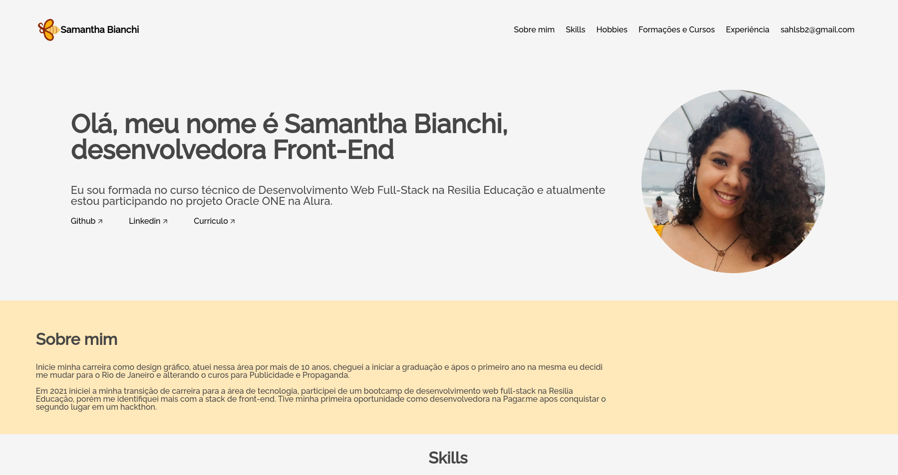

# Challenge ONE | Front End - Portfólio
---

     

Este projeto faz parte do primeiro desafio da trilha de front-end T6 ONE + Alura. Ele consiste em criar um portfólio com validações em JavaScript para os campos do formulário não serem enviados sem informações.

O layout foi produzido pela própria equipe da Alura, porém fiz algumas alterações para deixá-lo mais com a minha cara.

